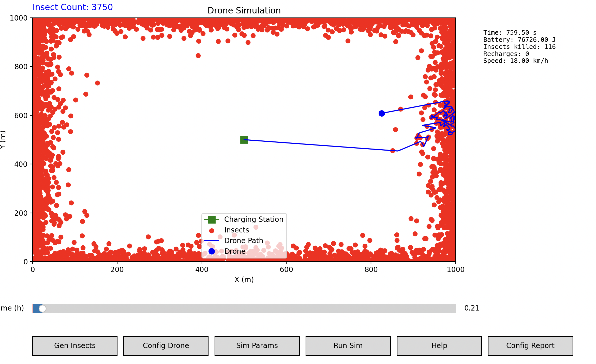
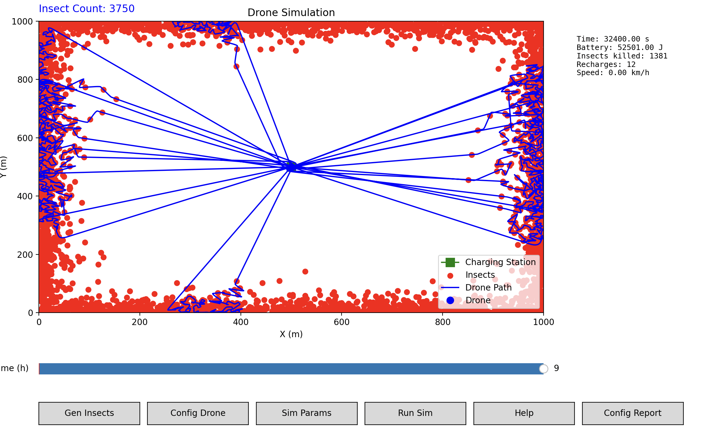

Below is an extended guide that not only explains how to install Python, set up dependencies, and run the code, but also dives into additional details about how the simulation uses a TSP-like algorithm (and strategies to split insects into manageable batches) as well as the “physical” modeling aspects—how the drone accelerates toward targets and adjusts its movement.

---

# Drone Simulation Guide

This guide explains how to set up and run the simulation, describes each simulation step, and provides an in-depth look at the underlying modeling techniques.

# Screenshots

We can see the drone is on his way back to the recharge station:


We can see how many insects the drone killing in a 9 hour window (with the current settings):


[Watch Video](https://www.youtube.com/watch?v=hrJzrAwy-MY)
---

## 1. Environment Setup

### 1.1. Installing Python
- **Download Python:**  
  Visit the [Python official website](https://www.python.org/downloads/) and download the latest Python version (Python 3.8 or later is recommended).
  
- **Install Python:**  
  Run the installer on your system. **On Windows, be sure to select “Add Python to PATH”** when installing.

### 1.2. Installing Dependencies
The simulation requires these Python packages:
- **NumPy** for numerical operations.
- **Matplotlib** for plotting and GUI widgets (sliders, buttons).

**Installation Command:**
Open your terminal (or command prompt) and run:

```bash
pip install numpy matplotlib
```

This command will install all necessary packages for your simulation.

---

## 2. Running the Simulation Code

### 2.1. Saving the Code
1. **Copy the Full Code:**  
   Copy the entire simulation code into a text editor.
2. **Save the File:**  
   Save the file with a name such as `drone_simulation.py`.

### 2.2. Executing the Code
Run the simulation from the terminal:

```bash
python drone_simulation.py
```

When executed, the script opens a graphical user interface (GUI) window with a plotting area, buttons, and sliders.

---

## 3. Simulation Workflow

The simulation GUI is designed to let you interact with several steps. The workflow mainly follows these steps:

### Step 1: Generate Insects
- **Action via Button:** Click **"Gen Insects"**.  
- **What It Does:**  
  - Uses a random process (with a Poisson distribution) to generate insect positions over a specified field.
  - Insects are positioned based on a base rate, modified by a decay function that reduces insect likelihood near the borders.
- **Outcome:**  
  - Red markers representing insects appear within the simulation field.

### Step 2: Configure the Drone
- **Action via Button:** Click **"Config Drone"**.  
- **What It Does:**  
  - Opens a configuration window with sliders to adjust key drone parameters, including:
    - **Max Acceleration and Max Speed:** Determines how fast the drone can change its velocity.
    - **Energy Consumption and Battery Capacity:** Controls the available energy.
    - **Laser Shot Energy:** Energy required per insect engagement.
    - **Low Battery Threshold:** Battery level at which the drone will return to the charging station.
    - **Lock Time:** Delay for acquiring a lock on target insects.
    - **Engagement Range:** Distance at which the drone can engage insects.
    - **Max Lock Speed (km/h):** Ensures the drone decelerates before locking onto targets.
    - **Number of Lasers & Battery Cells:** Configurable options affecting power and operation.
- **Outcome:**  
  - Parameter values are updated once you click **"Apply"**; the drone will use these settings in subsequent simulation runs.

### Step 3: Run the Simulation
- **Action via Button:** Click **"Run Sim"**.  
- **What It Does:**  
  - Initiates the simulation by letting the drone move towards insect targets.
  - The drone follows a computed route (using a nearest-neighbor TSP approach) and, if necessary, slows down prior to locking onto targets.
  - The simulation records key flight data (e.g., time, speed, battery status) and plots the drone’s path.
- **Outcome:**  
  - A timeline slider and an information box are available to track the simulation progress as the drone moves and engages insects.

Additional buttons like **"Sim Params"**, **"Help"**, and **"Config Report"** allow you to adjust time-step parameters, review help information, or see the overall configuration in JSON format.

---

## 4. Behind the Scenes: TSP and Insect Batching

### 4.1. TSP (Traveling Salesman Problem) Overview
- **The Challenge:**  
  The simulation must determine the most efficient route for the drone to visit insect locations.
- **Nearest-Neighbor Heuristic:**  
  The code implements a nearest-neighbor algorithm:
  - **Standard TSP Function:**  
    The function `nearest_neighbor_tsp` starts from the current position and repeatedly selects the closest insect to visit next.
  - **Optimized Version:**  
    For a large number of insects, `nearest_neighbor_tsp_fast` uses a similar approach using NumPy arrays for improved performance.

### 4.2. Splitting Insects into Smaller Batches
- **Why Split:**  
  When there are thousands of insects, solving TSP on the complete dataset becomes computationally expensive.
- **Batching Strategy:**  
  - **Grid Partitioning:**  
    The function `get_insect_subset_by_grid` divides the field into a grid of cells.
  - **Selecting a Subset:**  
    The grid cell with the highest insect count is identified. Insects in that cell and its immediate neighbors are then grouped into a smaller batch.
  - **Recalculation:**  
    The function `recalc_route` either works with the full insect set (if few insects remain) or uses the subset, improving efficiency and keeping the route manageable.
  
This grid-based approach allows the simulation to focus on a local group of targets rather than solving for the entire field at once—thus approximating the way a drone might “zoom in” on a hotspot of activity.

---

## 5. Physical Modeling of Drone Motion

The simulation models basic physics to govern the drone’s movement.

### 5.1. Accelerating Toward a Target
- **Applying Acceleration:**  
  - The method `apply_acceleration_towards` in the **Drone** class computes the desired acceleration by determining the direction to the target.
  - It calculates a desired velocity based on the drone's maximum speed and then computes the required change in velocity over the time step `dt`.
  - The computed acceleration is scaled to ensure it does not exceed the drone’s maximum allowable acceleration.
- **Updating Drone State:**  
  - The `update` method updates the drone’s velocity and position given the computed acceleration.
  - It ensures that the drone's speed does not surpass the maximum speed.  
  - Energy consumption for each time step is also deducted from the battery, using a fixed consumption rate.

### 5.2. Slowing Down for Target Engagement
- **Need for Precise Engagement:**  
  - Before locking onto insects, the drone must decelerate so that its speed falls within a predefined “lock speed” (configured via a slider).
- **Slowing Down Mechanism:**  
  - The `slow_down` function continuously applies a braking acceleration (in the direction opposite to the current velocity) until the drone's speed is at or below the target lock speed.
  - This process is modeled using the same `update` method, ensuring realistic dynamics and simulation continuity.

### 5.3. Engaging Targets
- **Lock and Shoot:**  
  - Once within the engagement range and at a safe speed, the drone spends a specified lock time to acquire its target.
  - After the lock delay, energy is expended for each laser shot, and the engaged insects are removed from the simulation.
  
These physical models—using acceleration, deceleration, and energy consumption—provide the simulation with a framework that approximates real-world drone flight in a simplified manner.

---

## 6. Current Simulation Weaknesses

While the simulation integrates many real-world components, there are some simplifications:

### 6.1. Power Consumption
- **Current Model:**  
  Energy consumption is implemented as a fixed rate (Joules per second) regardless of the acceleration or speed.
- **Limitation:**  
  In actual drones, power draw increases with higher acceleration (greater thrust) and may vary with speed and wind resistance. A more realistic model would tie energy consumption dynamically to the drone’s motion and environmental factors.

### 6.2. Simplified Aerodynamics
- **Current Model:**  
  The drone’s motion is governed solely by the applied acceleration toward the target without considering:
  - Air drag (resistance)
  - Lift variations or turning penalties.
- **Limitation:**  
  More sophisticated models could incorporate drag coefficients and other aerodynamic parameters to simulate the drone’s performance in varied environments.

### 6.3. Battery Dynamics
- **Current Model:**  
  The battery is represented by a simple energy capacity and discharges at a steady rate.
- **Limitation:**  
  Real batteries have nonlinear discharge characteristics and their performance can degrade over time or with varying loads.

### 6.4. Route Optimization
- **Current Model:**  
  The simulation uses a nearest-neighbor heuristic for the TSP.  
- **Limitation:**  
  While computationally efficient, this approach may not always yield the most optimal route for visiting insect clusters. More advanced routing strategies (or even iterative improvements) may offer better performance, especially on large-scale problems.

---

## Conclusion

This guide provided step-by-step instructions for setting up your Python environment, installing dependencies, and running the simulation. You learned how to:
1. **Generate Insects** with the **"Gen Insects"** button.
2. **Configure the Drone** through the **"Config Drone"** window where you set parameters like acceleration, speed, and max lock speed.
3. **Run the Simulation** by clicking **"Run Sim"**, where the drone navigates the field, engages insects, and logs its data.

Additionally, the guide explains:
- **TSP and Insect Batching:** The code uses a nearest-neighbor approach and grid-based subset selection to manage route planning for a large number of targets.
- **Physical Modeling:** The simulation models drone acceleration, deceleration, and energy consumption in a simplified manner to mimic real-world behavior.

Understanding these components will help you further adjust and refine the simulation to better approximate realistic behavior or to address current weaknesses.

Enjoy experimenting with the code and improving your simulation!
